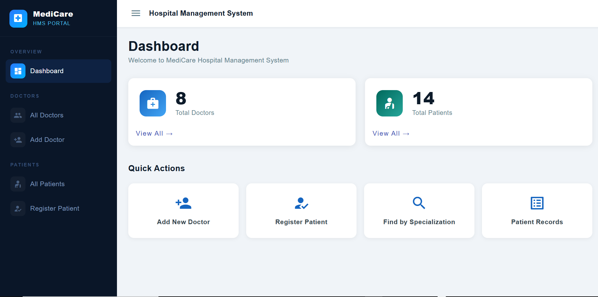
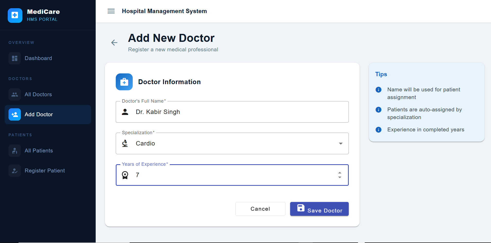
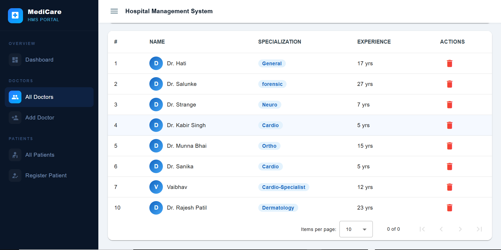
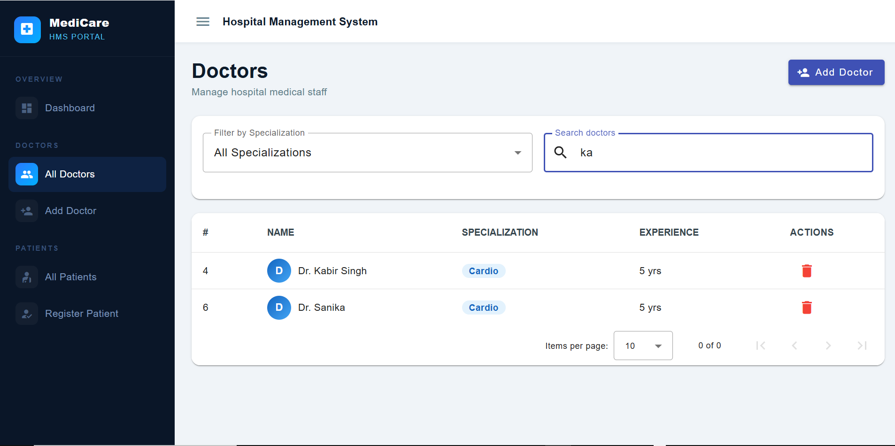
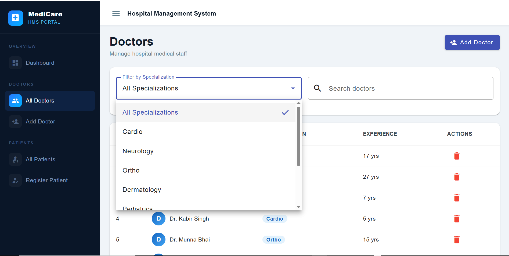
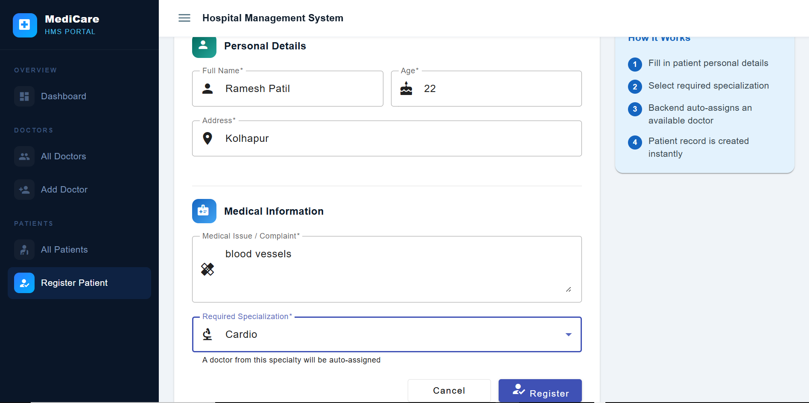
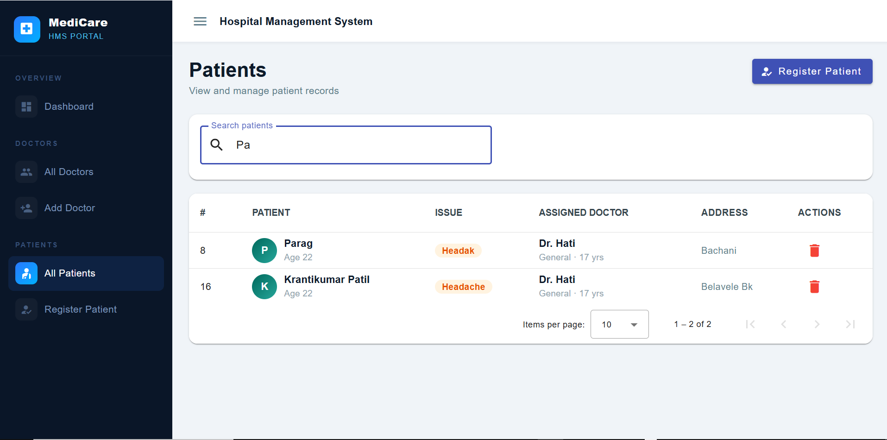
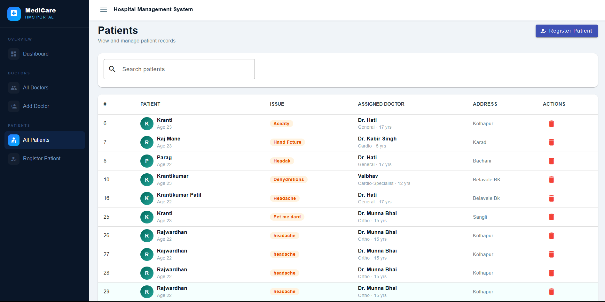
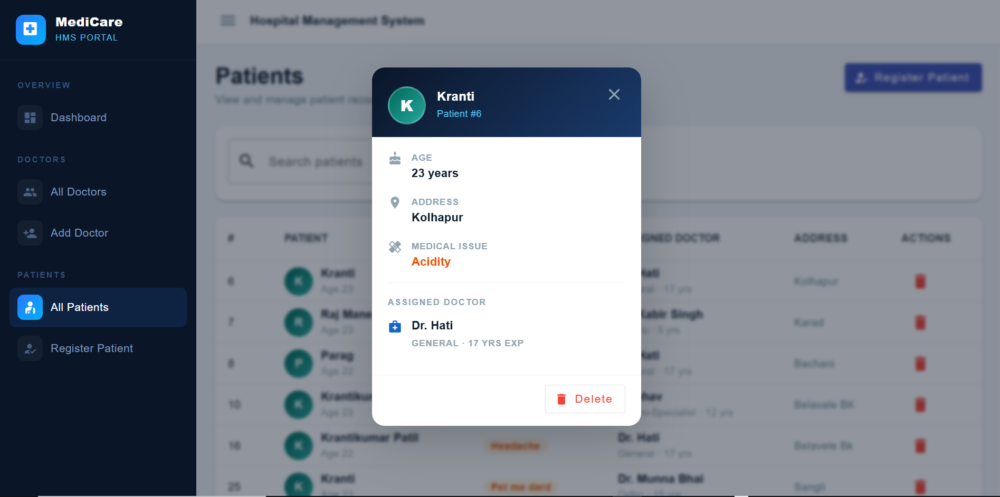

<<<<<<< HEAD
🏥 **Hospital Management Software (Microservices)**

A Spring Boot–based Hospital Management System implemented using Microservices Architecture.
The system manages Doctors, Patients, and Service Discovery using Netflix Eureka.
---

📌 **Project Architecture**

This project follows a Microservices Monorepo structure with three services:

```
HospitalManagementSoftware
│
├── HospitalManagementSoftware-Server   (Eureka Server)
├── HospitalManagementSoftware-Doctor   (Doctor Microservice)
└── HospitalManagementSoftware-Patient  (Patient Microservice)
=======
# 🏥 Hospital Management Software (Full Stack)

A complete **Hospital Management System** built using **Spring Boot Microservices** (backend) and **Angular + Angular Material** (frontend). The system manages Doctors, Patients, automatic doctor assignment based on specialization, and Service Discovery using Netflix Eureka.

---

## 📌 Project Architecture

```
HospitalManagementSoftware

│

├── backend

│   ├── HospitalManagementSoftware-Server   (Eureka Server)

│   ├── HospitalManagementSoftware-Doctor   (Doctor Microservice)

│   └── HospitalManagementSoftware-Patient  (Patient Microservice)

│

├── hospital-management-ui (Angular Application)

│

├── screenshots

│

└── README.md

```

---


**Technologies Used**

Java

Spring Boot

Spring Data JPA

Spring Web (REST APIs)

Spring Cloud Netflix Eureka

Maven

MySQL / H2 (as configured)

REST Template

Git & GitHub

---

**Microservices Description**

1️⃣ HospitalManagementSoftware-Server (Eureka Server)

Acts as a Service Registry

All microservices register here

Enables service discovery

📍 Annotation used:

@EnableEurekaServer

2️⃣ HospitalManagementSoftware-Doctor (Doctor Service)

Responsibilities:

Manage doctor information

Provide doctor data to Patient service

Key APIs:

GET /allDoctors → Fetch all doctors

POST /saveDoctor → Add new doctor

GET /fetchDoctor/{spec} → Fetch doctors by specialization

Entities:

Doctor

doctorId

doctorName

doctorSpec

doctorExp

3️⃣ HospitalManagementSoftware-Patient (Patient Service)

Responsibilities:

Manage patient information

Communicates with Doctor service using Eureka + RestTemplate

Key APIs:

GET /allPatients → Fetch all patients

POST /registerPatient/{spec} → Register patient and assign doctor

DELETE /deletePatient/{id} → Delete patient

Special Feature:

Automatically assigns a doctor based on specialization

Fetches doctor details from Doctor microservice via Eureka

---

🔁 **Inter-Service Communication**

Uses DiscoveryClient

Uses RestTemplate

Doctor service is discovered dynamically via Eureka

client.getInstances("HospitalManagementSoftware-Doctor");

---

🗄 **Database Structure**

Doctor Table
Doctor_info
- doctor_id
- name
- specification
- experience

Patient Table
Patient_info
- patient_id
- name
- address
- age
- issue
- doctor_name
- doctor_spec
- doctor_exp

---

▶️ **How to Run the Project**

Step 1: Start Eureka Server
HospitalManagementSoftware-Server

Step 2: Start Doctor Service
HospitalManagementSoftware-Doctor

Step 3: Start Patient Service
HospitalManagementSoftware-Patient

⚠️ Ensure Eureka Server is running before other services.

---

📂 **API Testing**

You can test APIs using:

Postman

Browser (GET APIs)

Example:

http://localhost:8081/allDoctors
http://localhost:8082/allPatients

---

👨‍💻 Author

Krantikumar Dilip Patil
=======
## 🛠 Technologies Used

### Backend
- Java
- Spring Boot
- Spring Data JPA
- Spring Web (REST APIs)
- Spring Cloud Netflix Eureka
- Maven
- MySQL
- RestTemplate
- Git & GitHub

### Frontend
- Angular (Standalone Components)
- Angular Material
- TypeScript
- RxJS
- HTML5 / CSS3

---

## 🔧 Microservices Description

### 1️⃣ HospitalManagementSoftware-Server (Eureka Server)
- Acts as a Service Registry
- All microservices register here
- Enables service discovery

📍 Annotation used: `@EnableEurekaServer`

---

### 2️⃣ HospitalManagementSoftware-Doctor (Doctor Service)

**Responsibilities:**
- Manage doctor information
- Provide doctor data to Patient service

**Key APIs:**
| Method | Endpoint | Description |
|--------|----------|-------------|
| GET | `/doctorapi/allDoctors` | Fetch all doctors |
| POST | `/doctorapi/saveDoctor` | Add new doctor |
| GET | `/doctorapi/fetchDoctors/{spec}` | Fetch doctors by specialization |
| DELETE | `/doctorapi/deleteDoctor/{id}` | Delete a doctor |

**Entity: Doctor**
- doctorId
- doctorName
- doctorSpec
- doctorExp

---

### 3️⃣ HospitalManagementSoftware-Patient (Patient Service)

**Responsibilities:**
- Manage patient information
- Communicates with Doctor service using Eureka + RestTemplate

**Key APIs:**
| Method | Endpoint | Description |
|--------|----------|-------------|
| GET | `/patientapi/allPatients` | Fetch all patients |
| GET | `/patientapi/patient/{id}` | Fetch patient by ID |
| POST | `/patientapi/registerPatient/{spec}` | Register patient and auto-assign doctor |
| DELETE | `/patientapi/deletePatient/{id}` | Delete patient |

**Special Feature:**
- Automatically assigns a doctor based on specialization
- Fetches doctor details from Doctor microservice via Eureka

---

## 🔁 Inter-Service Communication

- Uses `DiscoveryClient`
- Uses `RestTemplate`
- Doctor service is discovered dynamically via Eureka:

```java
client.getInstances("HospitalManagementSoftware-Doctor");
```

---

## 🗄 Database Structure

### Doctor Table — `Doctor_info`
| Column | Description |
|--------|--------------|
| doctor_id | Primary Key |
| name | Doctor name |
| specification | Specialization |
| experience | Years of experience |

### Patient Table — `Patient_info`
| Column | Description |
|--------|--------------|
| patient_id | Primary Key |
| name | Patient name |
| address | Patient address |
| age | Patient age |
| issue | Medical issue |
| doctor_name | Assigned doctor name |
| doctor_spec | Assigned doctor specialization |
| doctor_exp | Assigned doctor experience |

---

## ⚙️ MySQL Configuration

Each microservice connects to its own MySQL database. Add the following configuration to the `application.properties` file of the **Doctor** and **Patient** services (located in `src/main/resources/`).

### HospitalManagementSoftware-Doctor

```properties
spring.application.name=HospitalManagementSoftware-Doctor
server.port=8081

eureka.client.service-url.defaultZone=http://localhost:8761/eureka/

spring.datasource.url=jdbc:mysql://localhost:3306/hospital_doctor?createDatabaseIfNotExist=true&useSSL=false&serverTimezone=UTC
spring.datasource.username=root
spring.datasource.password=YOUR_MYSQL_PASSWORD
spring.datasource.driver-class-name=com.mysql.cj.jdbc.Driver

spring.jpa.hibernate.ddl-auto=update
spring.jpa.show-sql=true
spring.jpa.properties.hibernate.dialect=org.hibernate.dialect.MySQLDialect
```

### HospitalManagementSoftware-Patient

```properties
spring.application.name=HospitalManagementSoftware-Patient
server.port=8082

eureka.client.service-url.defaultZone=http://localhost:8761/eureka/

spring.datasource.url=jdbc:mysql://localhost:3306/hospital_patient?createDatabaseIfNotExist=true&useSSL=false&serverTimezone=UTC
spring.datasource.username=root
spring.datasource.password=YOUR_MYSQL_PASSWORD
spring.datasource.driver-class-name=com.mysql.cj.jdbc.Driver

spring.jpa.hibernate.ddl-auto=update
spring.jpa.show-sql=true
spring.jpa.properties.hibernate.dialect=org.hibernate.dialect.MySQLDialect
```

> Replace `YOUR_MYSQL_PASSWORD` with your actual MySQL root password.
> The `createDatabaseIfNotExist=true` flag auto-creates the databases on first run, and `ddl-auto=update` auto-creates/updates the required tables.

### Required Maven Dependency

Add this to the `pom.xml` of both the Doctor and Patient services:

```xml
<dependency>
    <groupId>com.mysql</groupId>
    <artifactId>mysql-connector-j</artifactId>
    <scope>runtime</scope>
</dependency>
```

---

## ▶️ How to Run the Project

### Backend Setup

**Step 1:** Start Eureka Server
```bash
cd backend/HospitalManagementSoftware-Server
mvn spring-boot:run
```

**Step 2:** Start Doctor Service
```bash
cd backend/HospitalManagementSoftware-Doctor
mvn spring-boot:run
```

**Step 3:** Start Patient Service
```bash
cd backend/HospitalManagementSoftware-Patient
mvn spring-boot:run
```

⚠️ **Ensure Eureka Server is running before starting other services.**

---

### Frontend Setup

```bash
cd frontend/hospital-management-ui
npm install
ng serve
```

Open the browser at: `http://localhost:4200`

---

## 📂 API Testing

You can test backend APIs using:
- Postman
- Browser (for GET APIs)

**Examples:**

http://localhost:8081/doctorapi/allDoctors

http://localhost:8082/patientapi/allPatients

---

## 🖼 Application Screenshots

### 1. Dashboard
Overview of total doctors, total patients, and key hospital statistics.



---

### 2. Add New Doctor
Form to register a new doctor with name, specialization, and years of experience.



---

### 3. All Doctors List
Displays a complete table of all registered doctors with sorting and pagination.



---

### 4. Search Doctors
Real-time search functionality to filter doctors by name or specialization.



---

### 5. Filter by Specialization
Filter the doctor list dynamically based on a selected medical specialization.



---

### 6. Register New Patient
Form to register a new patient, including personal details and medical issue. The backend automatically assigns an available doctor based on the selected specialization.



---

### 7. Search Patients
Search bar to quickly filter patients by name, issue, or assigned doctor.



---

### 8. All Patients List
Complete table view of all registered patients with their assigned doctors, address, and medical issues.



---

### 9. Special Data View
Detailed pop-up view showing complete information of a selected patient including age, address, medical issue, and assigned doctor details.



---

## 👨‍💻 Author

**Krantikumar Dilip Patil**

